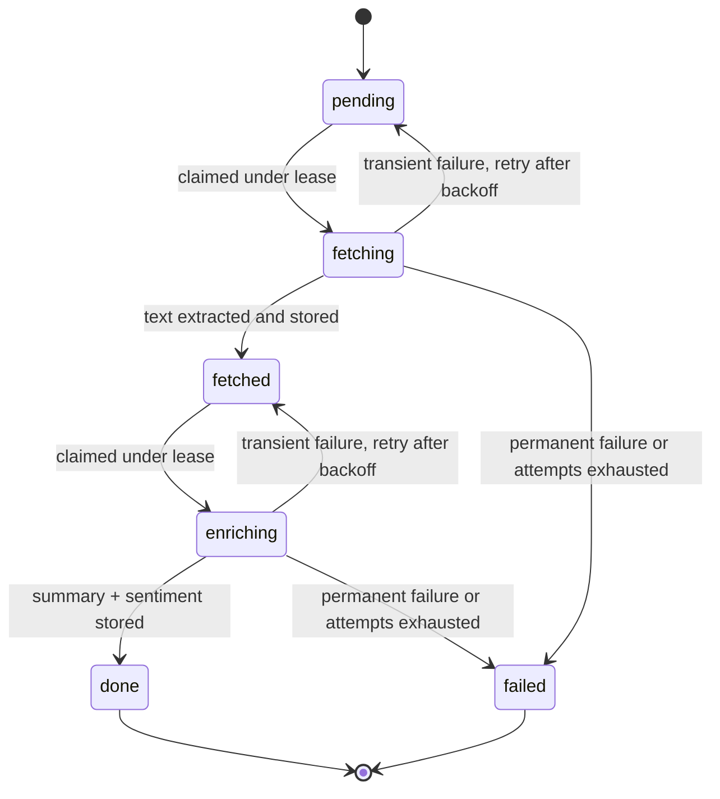

# Sentiment

A small FastAPI service that accepts a batch of URLs, fetches each page, extracts its text,
and enriches it with an LLM (summary + sentiment). Results are stored and read back by batch.

The interesting part of the problem isn't the endpoints — it's what happens when you submit a
thousand URLs over an unreliable network and something dies halfway through. So the design
question this repo answers is **where the work lives**, and the answer is: in the database, as
rows, from the moment the request is accepted.

- **Demo page:** https://\<you\>.github.io/sentiment/
- **Interactive API docs:** https://yantra-api-angwe5hwbehsh6g3.centralus-01.azurewebsites.net/docs

---

## Run it locally

No API keys required — the LLM is behind an interface with a mock implementation by default.

```bash
cd backend
cp .env.example .env          # fill in your database settings
uv sync
uv run python -m database.init_db
uv run uvicorn api.main:app --reload
```

Then open http://127.0.0.1:8000/docs, or point `docs/index.html` at
`http://127.0.0.1:8000` and use the demo page.

```bash
curl -X POST localhost:8000/batches -H 'content-type: application/json' \
  -d '{"urls": ["https://example.com", "https://example.com/nope"]}'
# -> 202 {"batch_id": "...", "total_items": 2, "duplicates_skipped": 0, ...}

curl localhost:8000/batches/<batch_id>
```

The API process also runs the worker pipeline in-process (`RUN_WORKER_IN_APP=true`), so one
command runs everything. In production you'd run `python -m services.run_worker` separately.

---

## Design

### The shape of it

Work is modelled as an **asynchronous queue over a database table**. Submission is an
*async request-reply* (202 + a status URL); processing is *competing consumers* pulling from a
queue table through two *pipes-and-filters* stages with independent concurrency limits.
Delivery is **at-least-once** — leases expire and a reaper requeues — so writes are idempotent.

`POST /batches` writes every URL as a `pending` row and returns. It fetches nothing. The 202
means *this work is durably recorded*, not *this work is done*. That single choice is what makes
the batch survive a deploy, an OOM kill, or a machine reboot: a restarted worker reads the table
and continues exactly where the old one stopped.

### Item lifecycle



`fetching` and `enriching` are transient states held under a lease. If a worker dies in one of
them, the lease lapses and the reaper returns the row to the preceding **durable** state —
`pending` or `fetched`.

### Two stages, not one

Fetching is network-bound and cheap; enrichment is rate-limited and expensive. They get separate
concurrency limits (a *bulkhead*) so slow LLM calls can't starve the fetcher.

More importantly, extracted text is **persisted between the stages**. A failed enrichment never
forces a re-fetch, and a page fetched after four attempts still gets a full retry budget for
enrichment.

### Claiming work

The claim is a single statement, so two workers can never take the same item:

```sql
UPDATE TOP (:limit) items WITH (UPDLOCK, READPAST, ROWLOCK)
   SET status = :to_status, attempts = attempts + 1, lease_expires_at = :lease
OUTPUT inserted.id, inserted.url, inserted.attempts
 WHERE status = :from_status AND next_attempt_at <= :now
```

`UPDLOCK` takes the write lock up front, `READPAST` skips rows another worker already holds
rather than blocking on them, and `OUTPUT` returns what we won. The Postgres equivalent is
`SELECT ... FOR UPDATE SKIP LOCKED`.

Workers only ever claim what they have capacity to start, in slices of `CLAIM_SIZE`. That's the
backpressure: an unbounded batch is processed in bounded chunks, and nothing sits under lease
waiting for a free worker.

### Retries

Backoff is a **timestamp**, not a sleep. A transient failure sets `next_attempt_at` into the
future and releases the item; the worker never blocks, and the delay survives a restart.

Failures are classified before anything is retried:

| Failure | Treated as | Why |
|---|---|---|
| Connect/read timeout, connection reset | transient | Routinely succeeds on a retry |
| HTTP 429, 503 | transient, honours `Retry-After` | The server told us when to come back |
| HTTP 5xx, 408 | transient | The origin's problem, not ours |
| HTTP 404/401/403/410 | **permanent** | An identical request gets an identical answer |
| Non-text content type | permanent | There is no text to enrich |
| Response over size cap | permanent | Won't shrink on a retry |
| Host resolves to a private IP | permanent | Blocked deliberately, see below |
| LLM rate limit / 5xx | transient | Provider-side |
| LLM 4xx | permanent | Our request is malformed |

Retrying a 404 wastes attempts and delays the batch; giving up on a connection reset loses work
that would have succeeded. Backoff is exponential with **full jitter** — when a host goes down
every in-flight item fails at once, and without jitter they'd all retry in the same instant.

### Guardrails

- **Per-host concurrency limit** — the global limit protects our egress, this protects the
  origin site.
- **Streaming reads with a byte cap** — a hostile or misconfigured server can't exhaust memory.
- **SSRF guard** — submitted hosts (and redirect targets) that resolve to private, loopback,
  link-local or reserved addresses are rejected. Without it, anyone could make the service fetch
  `169.254.169.254` on their behalf. Best-effort: DNS can change between check and connect.
- **Rate limiting** — per-IP sliding window, writes limited far more tightly than reads, because
  one POST can enqueue thousands of outbound fetches while polling is cheap.

---

## API

### `POST /batches`

```json
{ "urls": ["https://example.com", "https://EXAMPLE.com:443/#top"] }
```

URLs are normalised (lowercased scheme/host, default port and fragment dropped) and deduped by
hash within the batch, enforced by a unique constraint rather than by the handler. Returns `202`:

```json
{
  "batch_id": "0195f3c2-1a4e-7b3d-9f21-6c8ae0d41b77",
  "total_items": 1,
  "duplicates_skipped": 1,
  "results_url": "http://localhost:8000/batches/0195f3c2-..."
}
```

The batch row and all item rows are written in **one transaction** — there is no window in which
a client holds an id for work that was never enqueued.

Rejects with `422`: an empty list, a non-http(s) scheme, a malformed URL, or more than 5000 URLs.

### `GET /batches/{batch_id}`

Query params: `status` (filter), `limit` (default 100, max 1000), `offset`.

```json
{
  "batch_id": "0195f3c2-...",
  "created_at": "2026-08-13T10:14:02Z",
  "total_items": 3,
  "counts": {"pending": 0, "fetching": 1, "fetched": 0, "enriching": 0, "done": 1, "failed": 1},
  "complete": false,
  "items": [
    {"url": "https://example.com", "status": "done", "retries": 0,
     "http_status": 200, "summary": "...", "sentiment": "neutral",
     "error_kind": null, "error_detail": null},
    {"url": "https://example.com/nope", "status": "failed", "retries": 0,
     "http_status": null, "summary": null, "sentiment": null,
     "error_kind": "http_4xx", "error_detail": "HTTP 404"}
  ]
}
```

Safe to poll: the counts are one grouped aggregate over an index and the item page is bounded,
so this stays cheap for a batch of any size. `retries` is 0 when an item worked first time — the
worker's internal per-stage attempt counter is not exposed.

`404` if the batch doesn't exist. `429` with `Retry-After` if rate limited.

---

## The LLM interface

```python
class Enricher(Protocol):
    async def enrich(self, url: str, text: str) -> Enrichment: ...
```

The pipeline only ever sees this protocol, so the mock and a real provider are interchangeable
and neither the workers nor the tests need an API key.

- **`MockEnricher`** (default) — deterministic: sentiment is derived from a hash of the page
  text, so the same page always produces the same answer and tests can assert on it. Latency and
  failures are injected *non*-deterministically via `MOCK_LATENCY_SECONDS` and
  `MOCK_FAILURE_RATE`, because the point of them is to exercise the retry path.
- **`OpenAIEnricher`** (optional) — set `ENRICHER=openai` and `OPENAI_API_KEY`. Imported lazily,
  so `openai` isn't a hard dependency. Classifies rate limits and 5xx as transient, 4xx as
  permanent.

This is also the seam where a cache keyed on `content_hash`, or a token-bucket rate limiter,
would go.

---

## Schema

Two tables. `batches` (id, created_at, total_items) and `items`, which is both the queue entry
and the result row.

There is deliberately **no `batches.status` column** — progress is a `GROUP BY`, so there's no
counter to keep correct under concurrent workers. And deliberately **no separate `results`
table** — it would be 1:1 with items, forcing a join on every read and an extra insert inside
the transaction that completes an item. Splitting it out only earns its keep if you want to
re-enrich the same fetched text with a different model and keep both.

The two fields that carry the reliability story:

- `next_attempt_at` — the retry clock. Backoff is just a future timestamp.
- `lease_expires_at` — crash recovery. Expiry is what makes `kill -9` survivable.

---

## Configuration

All via environment variables (or `.env`). Defaults are sensible for local use.

**Database**

| Variable | Default |
|---|---|
| `DB_SERVER`, `DB_NAME`, `DB_USER`, `DB_PASSWORD` | required |
| `DB_PORT` | `1433` |
| `DB_DRIVER` | `ODBC Driver 18 for SQL Server` |
| `DB_ENCRYPT` / `DB_TRUST_SERVER_CERTIFICATE` | `yes` / `no` |

**Worker**

| Variable | Default | Notes |
|---|---|---|
| `RUN_WORKER_IN_APP` | `true` | Run the pipeline inside the API process |
| `FETCH_CONCURRENCY` | `20` | |
| `ENRICH_CONCURRENCY` | `5` | Separate from fetch on purpose |
| `PER_HOST_CONCURRENCY` | `4` | Politeness to origin sites |
| `CLAIM_SIZE` | `20` | Rows claimed per round trip |
| `LEASE_SECONDS` | `120` | Must exceed worst-case item processing time |
| `POLL_INTERVAL_SECONDS` | `1.0` | |
| `REAPER_INTERVAL_SECONDS` | `30.0` | |
| `MAX_ATTEMPTS` | `5` | Per stage |
| `BACKOFF_BASE_SECONDS` / `BACKOFF_MAX_SECONDS` | `2.0` / `300.0` | Full jitter applied |
| `CONNECT_TIMEOUT_SECONDS` / `READ_TIMEOUT_SECONDS` / `TOTAL_TIMEOUT_SECONDS` | `5` / `10` / `20` | |
| `MAX_RESPONSE_BYTES` | `5000000` | |
| `MAX_TEXT_CHARS` | `20000` | |
| `MAX_REDIRECTS` | `5` | |
| `ALLOW_PRIVATE_HOSTS` | `false` | Only enable to test against a local origin |
| `ENRICHER` | `mock` | `mock` or `openai` |
| `MOCK_FAILURE_RATE` | `0.0` | Inject transient LLM failures |
| `MOCK_LATENCY_SECONDS` | `0.1` | |
| `OPENAI_API_KEY` / `OPENAI_MODEL` | — / `gpt-4o-mini` | |

**API**

| Variable | Default |
|---|---|
| `CORS_ORIGINS` | `*` (comma-separated list, or `*`) |
| `RATE_LIMIT_ENABLED` | `true` |
| `RATE_LIMIT_WRITES_PER_WINDOW` | `10` |
| `RATE_LIMIT_READS_PER_WINDOW` | `240` |
| `RATE_LIMIT_WINDOW_SECONDS` | `60` |

---

## Layout

```
backend/
  api/         routes, schemas, URL normalisation, rate limiting, CORS
  database/    models, session, settings, init_db (migration entrypoint)
  services/    worker pipeline, queue operations, fetcher, enricher, errors, settings
docs/          single-page demo client (GitHub Pages)
.github/       deploy workflow
```

---

## Deployment

`.github/workflows/deploy.yml` (manual trigger): build → migrate → deploy to Azure App Service,
then poll `/health/db` so a broken release fails the run.

**GitHub secrets:** `AZURE_PUBLISH_PROFILE`, `DB_SERVER`, `DB_NAME`, `DB_USER`, `DB_PASSWORD`.

**App Service settings:** the `DB_*` values, plus `SCM_DO_BUILD_DURING_DEPLOYMENT=true`,
`ENRICHER=mock`, `RUN_WORKER_IN_APP=true`, `CORS_ORIGINS=https://<you>.github.io`. Enable
**Always On**, or the app idles out and the worker stops draining the queue.

The build flattens `uv.lock` into a hash-pinned `requirements.txt`, since App Service builds with
pip. `pyproject.toml` is deliberately excluded from the deployment package so Oryx doesn't try to
build the project as a package.

Note that `pyodbc` needs the Microsoft ODBC Driver 18 present on the host; if the App Service
Python image doesn't ship it, the options are a custom container or switching the dialect to
`pymssql`.

---

## Testing

Verified end to end against the real database and a local origin server with deliberately
hostile endpoints:

| Behaviour | Result |
|---|---|
| 500, 500, 200 | `done` after 2 retries, 3 origin hits |
| 429 with `Retry-After` | honoured, then succeeded |
| 404 | `failed` immediately, **0 retries** — no budget wasted |
| Read timeout | retried to the cap, then `failed` with `error_kind=timeout` |
| `image/png` | rejected without reading the body |
| 3MB body against a 1MB cap | rejected mid-stream |
| 26-URL batch, per-host limit 4 | peak concurrency at the origin exactly 4 |
| Worker killed holding a lease | reaper recovered it; restarted pipeline finished the batch |
| Origin hit counts | matched expected exactly — no duplicate work |
| `SIGTERM` | drained in-flight items and exited cleanly |

Also verified: intra-batch dedupe (`https://EXAMPLE.com:443/a#x` collapses to
`https://example.com/a`), `ON DELETE CASCADE`, the status `CHECK` constraint, CORS preflight for
allowed and disallowed origins, and rate limiting returning `429` with CORS headers intact.

**The main gap:** these were verified with scripts, not a checked-in suite. The next piece of
work is `pytest` + `respx`, asserting the four cases that matter — peak concurrency never exceeds
the limit, a 500-then-200 sequence resolves with the right retry count, an interrupted worker
leaves every item reaching a terminal state, and `Retry-After` is actually honoured.

---

## Trade-offs and known limitations

**Why a queue table rather than Redis or SQS.** The queue entries *are* the domain rows — an item
is both the unit of work and the record holding the result. With a broker you'd write items to
the database and publish ids to Redis: two writes, no shared transaction, and orphaned rows if
the publish fails after the commit. That's the problem the transactional outbox pattern exists to
solve, and the solution to it is a queue table. It also runs with zero extra infrastructure.
It stops being the right call past roughly low-thousands of items per second, when the queue's
write and vacuum load starts competing with the application's own traffic — at that point the
claim logic here maps directly onto SQS visibility timeouts or arq.

**No lease renewal.** `LEASE_SECONDS` must comfortably exceed worst-case item processing time. A
long enrichment could be reaped and processed twice — safe, because writes are idempotent, but
wasteful.

**The reaper burns an attempt.** A crashed worker's item already incremented its counter at claim
time, and there's no way to distinguish a crash from a hang.

**The claim statement is SQL Server specific** (`READPAST`, `OUTPUT`). Postgres needs
`FOR UPDATE SKIP LOCKED`.

**Rate limiting is per-process.** Counters reset on restart and each instance enforces its own
budget. Shared limits need Redis.

**Batch fairness.** Items are claimed FIFO by `next_attempt_at`, so one huge batch delays later
ones. Fair-share scheduling between batches would need a different claim query.

**Not built, deliberately:** authentication, an `Idempotency-Key` on submit (a client retrying a
submission creates a second batch), cancel/retry endpoints, per-host circuit breaking, and
boilerplate-aware extraction (something like trafilatura) — that last one is a content-quality
problem rather than the pipeline problem this service is about.
